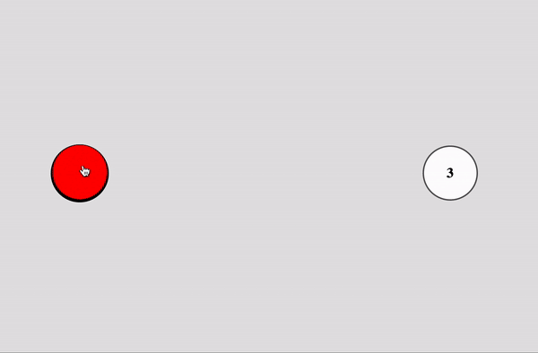
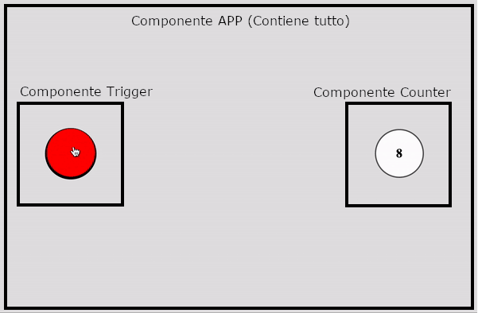

# Parte 1

Si realizzi una semplicissima applicazione HTML, CSS e JS Vanilla che funzioni come illustrato nell'immagine ```conta-click.gif```: il click su un semplice pulsante, causa l'incremento di un contatore.



# Parte 2

Si realizzi la stessa applicazione soprastante come un progetto vue/vite, ma con il vincolo di prevedere ALMENO tre componenti (come specificato nell'immagine ```conta-click-componenti.gif```):
- App: il componente che contiene tutta l'applicazione
- Counter: il componente che contiene il contatore, figlio di App
- Trigger: il compomente che contiene il pulsante, anch'esso figlio di App


